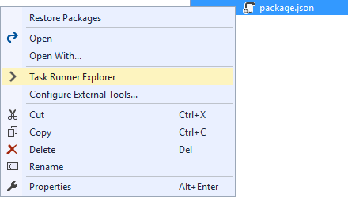
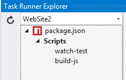
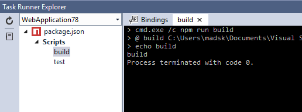
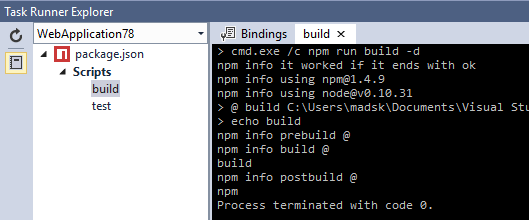
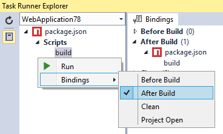

# NPM Task Runner

[](https://ci.appveyor.com/project/madskristensen/npmtaskrunner)

Download the extension at the
[VS Gallery](https://visualstudiogallery.msdn.microsoft.com/8f2f2cbc-4da5-43ba-9de2-c9d08ade4941)
or get the
[nightly build](http://vsixgallery.com/extension/d7f89ba3-815c-4feb-89b9-68d1654e2138/)

---------------------------------------------------------

Adds support for npm scripts defined in package.json 
directly in Visual Studio's Task Runner Explorer.

## [Yarn](https://yarnpkg.com/) support
If a *yarn.lock*, *.yarnclean*, or *.yarnrc* file exists in the same directory as *package.json*, then the Yarn CLI is being called instead of npm. This requires that you have manually installed [Yarn](https://yarnpkg.com/). A minimum Yarn version of [v0.22.0](https://github.com/yarnpkg/yarn/releases/tag/v0.22.0) is recommended for the best results.

## npm scripts

Inside package.json it is possible to add custom scripts inside
the "scripts" element.

```js
{
	"name": "test",
	"version": "1.0.0",
	"scripts": {
		"watch-test": "mocha --watch --reporter spec test",
		"build-js": "browserify -t reactify app/js/main.js | uglifyjs -mc > static/bundle.js"
	}
}
```

## Task Runner Explorer
Open Task Runner Explorer by right-clicking the `package.json`
file and select **Task Runner Explorer** from the context menu:



### Execute scripts
When scripts are specified, the Task Runner Explorer
will show those scripts.



Each script can be executed by double-clicking the task.



### Verbose output
A button for turning verbose output on and off is located
at the left toolbar.



The button is a toggle button that can be left
on or off for as long as needed.

### Bindings
Script bindings make it possible to associate individual scripts
with Visual Studio events such as "After build" etc.



## License
[Apache 2.0](LICENSE)
